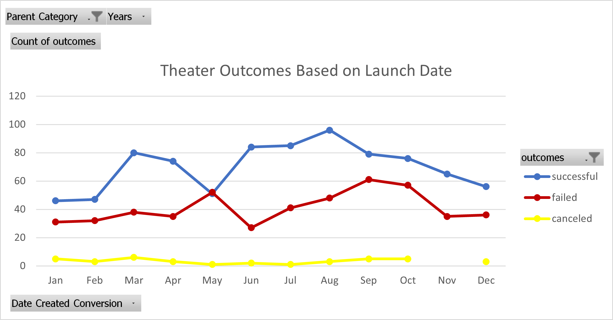
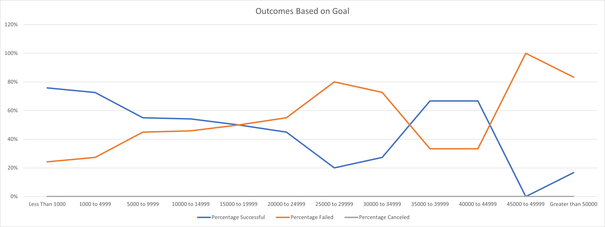

Kickstarting with Excel

    Overview of Project

    Louise’s play Fever came close to its fundraising goal in a short amount of time. Now, we are showing her how campaigns fared in relation to their launch dates and their funding goals.

    
    Purpose

    To analyze and show how theater fundraising campaigns fared based on launch dates and funding goals.

    
    Analysis and Challenges

    Analysis of Outcomes Based on Launch Date

    To analyze the outcomes based on launch date we created a Pivot Table in Microsoft Excel in which we are able to visualize the number of campaigns per outcome category and month in which it was launched. Results shown below include all available years, from 2004 to 2011, for the theater category only. 
    

      
    Finally, I did not encounter any challenge to this anaysis but I think is crucial to properly select all fields of the pivot table so that results are shown as required. 

    Analysis of Outcomes Based on Goals

    To analyze the outcomes based on goals we used the countifs function in Microsoft Excel and we were able to determine the % per outcome based on 12 goal categories. Results shown below include all available years, from 2004 to 2011, for the theater category only. 

    Finally, I did not encounter any challenge to this anaysis but I think is crucial to properly select the ranges to be used in the count formula. 

    Challenges and Difficulties Encountered

    No challenges were encountered, for possible challenges please refer to the subsection above. 

    Results

    - What are two conclusions you can draw about the Outcomes based on Launch Date?
        1. Irrespective of the month, there are more succesful campaigns than failed or canceled.
        2. The largest gap between sucessful and failed, as well as the largest number of succesful campaigns, took place between June and August (for all years).

    - What can you conclude about the Outcomes based on Goals?
        Campaigns with lower goals had higher % of success. Specifically for campaigns with goals of up to 19,999, at least 50% of them were successful.

    - What are some limitations of this dataset?
        1. It's an old data set, it only contains data from 2004 to 2011 which it's outdated and may lead to non-significant results for current conditions.
        2. Projects are global and includes both developed and developing countries, this could skew outcomes since funding needs and capacity may be different based on the purchasing parity of each country.

    - What are some other possible tables and/or graphs that we could create?
        1. Outcomes based on geography
        2. Outcomes based on currency
        3. Average donation and breakdown by category, subcategory, geography, currency and year
